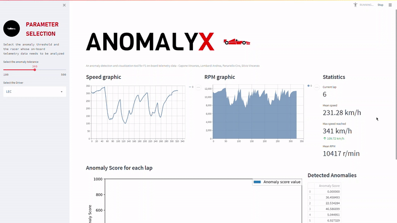
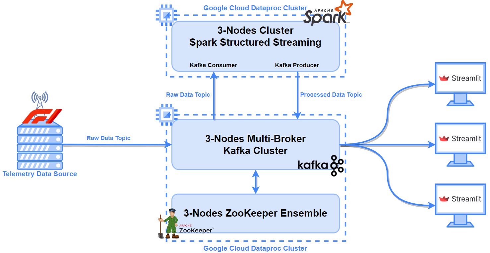

# Cloud-based data visualization and analysis tool for telemetry data
A naive data visualization and analysis tool for F1 on board telemetry data.

<div id="top"></div>


<!-- PROJECT LOGO -->
<br />
<div align="center">
  <a href="https://github.com/othneildrew/Best-README-Template">
    
  </a>

  <h3 align="center">Cloud-based data visualization and analysis tool for telemetry data</h3>

  <p align="center">
    <br />
    <a href="figs/anomalyx_demo.gif">View Demo</a>
  </p>
</div>


<!-- TABLE OF CONTENTS -->
<details>
  <summary>Table of Contents</summary>
  <ol>
    <li>
      <a href="#about-the-project">About The Project</a>
      <ul>
        <li><a href="#built-with">Built With</a></li>
      </ul>
    </li>
    <li>
      <a href="#getting-started">Getting Started</a>
      <ul>
        <li><a href="#prerequisites">Prerequisites</a></li>
        <li><a href="#installation">Installation</a></li>
      </ul>
    </li>
    <li><a href="#usage">Usage</a></li>
    <li><a href="#roadmap">Roadmap</a></li>
    <li><a href="#contributing">Contributing</a></li>
    <li><a href="#license">License</a></li>
    <li><a href="#contacts">Contacts</a></li>
    <li><a href="#acknowledgments">Acknowledgments</a></li>
  </ol>
</details>


<!-- ABOUT THE PROJECT -->
## About The Project
In both minor motorsport categories and racing e-sports there seems to be no easily accessible tool to collect, visualize and analyze live telemetry data. The user often has to perform complex installation tasks to run these tools on his own machine, which might not be powerful enough to handle real-time data stream analysis. 

This work proposes a possible **baseline architecture to implement a data visualization and analysis tool for on-board telemetry data**, completely based on cloud technologies and distributed systems. The proposed system falls under the Software-as-a-Service (SaaS) paradigm and relies on Infrastructure-as-a-Service (IaaS) cloud solutions to provide hardware support to its software components.

<p align="center" width="100%">
     
</p>

_For more info, please refer to the [Project report](/project_report_paper.pdf)_.

### Built With

This section lists all major frameworks/libraries used in this project.

Data source and front-end:
* [FastF1](https://github.com/theOehrly/Fast-F1) (v. 2.2.8)
* [Streamlit](https://streamlit.io/) (v. 1.9.0)

Back-end Apache services:
* [ZooKeeper](https://zookeeper.apache.org/)
* [Kafka](https://kafka.apache.org/) - [KafkaPython](https://github.com/dpkp/kafka-python)
* [Spark](https://spark.apache.org/docs/latest/structured-streaming-programming-guide.html) - [PySpark](https://github.com/apache/spark)

<p align="right">(<a href="#top">back to top</a>)</p>


<!--- GETTING STARTED --->
## Getting Started

To get your system up and running, follow these simple steps.

### Prerequisites

First, you need to have an **account on any cloud platform** from which you can access **cluster services**. We used Google Cloud Dataproc clusters, but any other cloud provider should do.

Following the next section, this is the architecture you will end up with.

<p align="center" width="100%">
     
</p>

### Installation

Make sure to have two clusters on which you can deploy the following technologies:

1. Apache ZooKeeper (v. 3.7.1) and Apache Kafka (v. 3.1.0) on one cluster.
2. Apache Spark (v. 3.1.2) on the other cluster.

* ZooKeeper is required in order to run Kafka. The following example shows how to properly setup on each cluster node the ```zoo.cfg``` file in the ```conf``` directory under the ZooKeeper home, to run a ZooKeeper ensemble over a three-nodes cluster:
  ```
  ticktime=2000
  dataDir=/var/lib/zookeeper
  clientPort=2181
  initLimit=20
  syncLimit=5
  server.1=hostnameA:2888:3888
  server.2=hostnameB:2888:3888
  server.3=hostnameC:2888:3888
  ```
* On each cluster node, the following key properties must be specified in the ```server.properties``` file, located in the ```config``` directory under the Kafka home.
  * ```broker.id=UID``` (where UID is a unique ID for this broker).
  * ```listeners=PLAINTEXT://internalIP:9092```
  * ```advertised.listeners=PLAINTEXT://externalIP:9092```
  * ```zookeeper.connect=hostnameA:2181,hostnameB:2181,hostnameC:2181/kafka_root_znode```

* If you're using Google Cloud Dataproc clusters, you don't need to manually install and configure Spark as it is already included in the cluster's VM image.

<p align="right">(<a href="#top">back to top</a>)</p>


<!-- USAGE EXAMPLES -->
## Usage
Before launching the streamlit client, make sure that:

* Both Kafka and Spark clusters are up and running.
* Specify the correct broker IPs and topic names in ```configuration.ini```.
* The data source is active and publishing on the correct Kafka topic. For test purposes, you could run the data stream producer process provided in this repo:
  ```sh
  python ./datastream_producer.py
  ```
* Start the Spark streaming analysis script on the spark cluster:
  ```sh
  spark-submit --packages org.apache.spark:spark-sql-kafka-0-10_2.12:3.1.2 ./structured_stream_process.py --broker <IP:port> --intopic <topicName> --outtopic <topicName>
  ```

Finally, you are ready to run the client:
```sh
streamlit run ./main.py
```

<p align="right">(<a href="#top">back to top</a>)</p>

<!-- ROADMAP -->
## Roadmap
These are some of the features we would like to add to this project.

- [x] Add anomaly threshold real-time choice
- [ ] Multidriver support (this involves kafka topics re-organization)
- [ ] Add statefulness to streamlit
    - [ ] Counter variables
    - [ ] Data dict
- [ ] Use MLlib into the Spark SS data analysis module

<p align="right">(<a href="#top">back to top</a>)</p>


<!-- CONTRIBUTING -->
## Contributing

Contributions are what make the open source community such an amazing place to learn, inspire, and create. Any contributions you make are **greatly appreciated**.

If you have a suggestion that would make this better, please fork the repo and create a pull request. You can also simply open an issue with the tag "enhancement".
Don't forget to give the project a star! Thanks again!

<p align="right">(<a href="#top">back to top</a>)</p>

<!-- CONTACT -->
## Contacts

* Andrea Lombardi - [Linkedin](https://www.linkedin.com/in/andrea-lombardi/)
* Vincenzo Silvio - [Linkedin](https://www.linkedin.com/in/vincenzo-silvio-0413321b8/)
* Ciro Panariello - [Linkedin](https://www.linkedin.com/in/ciro-panariello-57044119b/)
* Vincenzo Capone - [Linkedin](https://www.linkedin.com/feed/)

<p align="right">(<a href="#top">back to top</a>)</p>


<!-- ACKNOWLEDGMENTS -->
## Acknowledgments

Thanks to O'Reilly books about:
* [ZooKeeper](https://www.oreilly.com/library/view/zookeeper/9781449361297/)
* [Kafka](https://www.oreilly.com/library/view/kafka-the-definitive/9781492043072/)
* [Spark](https://www.oreilly.com/library/view/spark-the-definitive/9781491912201/)

Infrastructure-as-a-Service used for this project:
* [Google Cloud Dataproc](https://cloud.google.com/dataproc)

<p align="right">(<a href="#top">back to top</a>)</p>

<!-- MARKDOWN LINKS & IMAGES -->
<!-- https://www.markdownguide.org/basic-syntax/#reference-style-links -->
[product-screenshot]: images/screenshot.png
